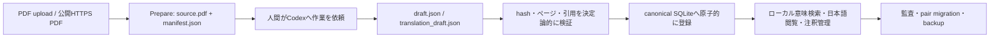

<p align="center">
  
</p>

<p align="center">
  
</p>

<h1 align="center">QuantMind Codex Paper Library</h1>

<p align="center">
  <b>原典・ページ根拠・日本語訳・説明画像をローカルで管理する、Codex対話型の論文データベース</b>
</p>

<p align="center">
  <a href="LICENSE"></a>
  <a href="https://python.org"></a>
  
  
</p>

<p align="center">
  <a href="#オリジナルとの違い">オリジナルとの差分</a> •
  <a href="#最短セットアップ">セットアップ</a> •
  <a href="docs/paper-library-manual-ja.md">日本語マニュアル</a> •
  <a href="docs/paper-library-setup.md">DB構築・移行</a> •
  <a href="#上流から継承するquantmindライブラリ">継承ライブラリ</a>
</p>

## このリポジトリについて

このリポジトリは、LLMQuantが公開するQuantMindを基礎に、ローカル論文DBとCodex対話型の運用機能を追加したforkです。

- **このfork:** [tikeda123/quant-mind-codex](https://github.com/tikeda123/quant-mind-codex)
- **オリジナル（upstream）:** [LLMQuant/quant-mind](https://github.com/LLMQuant/quant-mind)

オリジナルは、OpenAI Agents SDK上で金融知識を抽出・構造化・検索するPythonライブラリです。このforkはそのデータモデル、PaperFlow、LocalKnowledgeLibrary、RAG、開発ハーネスを継承し、人間が論文を継続的に読んで活用するためのローカルアプリケーションを追加しています。

> [!IMPORTANT]
> 「APIキー不要」は、このforkで追加したローカルPaper Libraryの経路を指します。PythonやStreamlitからCodexをAPIとして呼びません。上流から継承したOpenAI Agents SDK利用フローは、選択したモデルプロバイダの設定を別途必要とする場合があります。

## オリジナルとの違い

このforkの中心は [`apps/paper_library/`](apps/paper_library/) です。単なるREADME変更ではなく、論文の取り込みから根拠確認、翻訳、管理、検索、DB移行までを追加・拡張しています。

| 項目 | オリジナル `LLMQuant/quant-mind` | このfork `tikeda123/quant-mind-codex` |
|---|---|---|
| 主目的 | 定量金融向けの知識抽出・検索ライブラリ | 左記を継承し、人間が使うローカル論文DBを追加 |
| 主な操作方法 | Python APIとエージェント開発ハーネス | Streamlit管理UIと対話中のCodexによる明示的なファイル受け渡し |
| Codex連携 | Paper Library固有の運用契約なし | `source.pdf` / `manifest.json` / draft JSONを境界にして対話的に処理 |
| LLM API | Agents SDKフローは構成したプロバイダを利用 | Paper LibraryはCodex/OpenAIをPythonから呼ばず、外部LLM APIキー不要 |
| 論文入力 | PaperFlowの型付き入力 | UIからローカルPDFまたは公開HTTPS PDFをPrepare可能 |
| 根拠管理 | source-first、ページ対応artifact | PDF hash、ページ本文、exact quote、型付き注釈、登録監査を厳密に検証 |
| 日本語対応 | Paper Library用の全ページ翻訳管理なし | 全物理ページの日本語訳を別のimmutable artifactとして保存し、ページ単位で原文照合状態を管理 |
| 説明画像 | 論文管理UIでの画像注釈なし | PNG/JPEG/WebP、和文説明、出典、確認状態をsidecarへ保存 |
| 書誌・読書管理 | canonical knowledgeの保存と検索 | 人間が確認したタイトル・著者・公開情報、星、読書状態、タグ、コレクション、メモを管理 |
| 埋め込み | `LocalKnowledgeLibrary`のprivate provider seamと既定provider | private seamを保ったまま、固定revisionの `intfloat/multilingual-e5-small` をローカルCPUで利用 |
| 検索 | canonical knowledgeのsemantic retrieval | 日本語/英語クエリ、summary/chunk、読書状態・タグ・コレクション等の絞り込み |
| UI | Paper Library管理画面なし | ダッシュボード、蔵書、論文詳細、検索、取り込み、監査の6画面 |
| 永続化 | canonical SQLite | canonical SQLiteに加えて、個人情報と画像を分離したUI sidecar SQLite |
| 移行・バックアップ | fork固有のDB pair移行なし | 全table・row・BLOBを照合し、2つのSQLiteを一組で移行・受け入れ確認 |
| 自動運転 | 汎用 `batch_run` はライブラリ機能として存在 | Paper Libraryは人間確認を前提とし、Codex pollingや無人定期バッチを持たない |

### このforkで追加・拡張した主な場所

| 場所 | 変更内容 |
|---|---|
| [`apps/paper_library/`](apps/paper_library/) | loopback限定のStreamlit管理UI、canonical/sidecar連携 |
| [`quantmind/knowledge/paper.py`](quantmind/knowledge/paper.py) | cited annotation、登録記録、全ページ日本語訳などのcanonical model |
| [`quantmind/flows/paper/`](quantmind/flows/paper/) | Codexが作成したdraftを決定論的に検証・finalizeする処理 |
| [`quantmind/library/`](quantmind/library/) | 論文artifact、翻訳、監査、catalog、固定ローカル埋め込みのSQLite保存・検索 |
| [`scripts/`](scripts/) | PDF/翻訳準備、モデルcache、UI/E2E検証、DB pair移行 |
| [`docs/`](docs/) | 構築、運用、UI、永続化、移行の利用者向けマニュアル |
| [`tests/`](tests/) | 取り込み、検証失敗、原子性、翻訳、UI state、migrationを含むoffline test |

上流との差分をGitで確認する場合は、次のコマンドを使います。`origin` はオリジナル、`codex` はこのforkを指す構成です。

```bash
git fetch --prune origin
git fetch --prune codex
git log --oneline origin/master..master
git diff --stat origin/master..master
git diff --name-status origin/master..master
```

## Paper Libraryでできること

- PDF uploadまたは公開HTTPS PDF URLから原典を取り込み、PDFそのものとSHA-256を保存する。
- Codexとの対話で、ページ根拠付き要約と `source_fact` / `codex_interpretation` 注釈を作る。
- exact quote、ページ番号、chunk参照、原典hashが一致するdraftだけを登録する。
- 英文論文の全ページ日本語訳を保存し、英語原文との対訳表示とページ別レビューを行う。
- 論文の理解を補助する説明画像を、日本語の見出し・代替テキスト・出典・確認状態とともに管理する。
- 人間が確認したタイトル、著者、公開情報、星、読書状態、タグ、コレクション、メモを管理する。
- 固定ローカルモデルで日本語/英語の意味検索を行い、検索結果から原典ページへ戻る。
- canonical DBとsidecar DBを完全性検査付きで一組として移行・バックアップする。



## Codexとの役割分担

Codexは、このcheckoutで人間と対話しながら要約、注釈、日本語訳、画像説明の文案を作ります。アプリケーションはCodexを自動起動せず、Codex APIも呼びません。

| Codexが行うこと | Python/UIが行うこと |
|---|---|
| 原典を読んで要約・注釈・翻訳を作る | 原典PDFとmanifestを固定する |
| 指定contractに従うJSONを書く | schema、hash、ページ、引用、参照を検証する |
| 画像の意味を日本語で説明する | 画像bytesと人間の確認状態をsidecarへ保存する |
| 不明な書誌情報を原典から確認する | canonicalと個人表示情報を分離して永続化する |

実行できない、または意図的に実装していないものは、PythonからのCodex呼び出し、無人翻訳、バックグラウンドpolling、model選択UI、複数embedding backend、hybrid search、reranking、認証付きremote hostingです。

## 最短セットアップ

### 1. cloneとinstall

```bash
git clone https://github.com/tikeda123/quant-mind-codex.git
cd quant-mind-codex

uv venv
source .venv/bin/activate
uv pip install -e ".[full,ui]"
```

### 2. 固定ローカルモデルを一度だけcache

モデルweightの取得には公開networkを使いますが、Hugging Face API keyは不要です。通常の登録・検索は `local_files_only=True` です。

```bash
export QUANTMIND_RUNTIME_ROOT="/absolute/path/to/quantmind-codex-data"
mkdir -p "$QUANTMIND_RUNTIME_ROOT/models" "$QUANTMIND_RUNTIME_ROOT/intake"

python scripts/cache_local_embedding_model.py \
  --cache-dir "$QUANTMIND_RUNTIME_ROOT/models"
```

### 3. DB pathを指定してUIを起動

```bash
export QUANTMIND_LIBRARY_DB="$QUANTMIND_RUNTIME_ROOT/paper-library.sqlite3"
export QUANTMIND_UI_DB="$QUANTMIND_RUNTIME_ROOT/paper-library-ui.sqlite3"
export QUANTMIND_MODEL_CACHE="$QUANTMIND_RUNTIME_ROOT/models"
export QUANTMIND_INTAKE_ROOT="$QUANTMIND_RUNTIME_ROOT/intake"

streamlit run apps/paper_library/app.py \
  --server.address 127.0.0.1 \
  --server.port 8501
```

ブラウザで [http://127.0.0.1:8501](http://127.0.0.1:8501) を開きます。runtime rootはGit checkoutの外に置き、PDF、SQLite、model weight、intake中間fileをcommitしないでください。

### 4. 最初の論文を登録

1. **取り込み**でPDFまたは公開HTTPS URLを指定し、`Prepare`を選ぶ。
2. 画面に表示された `source.pdf`、`manifest.json`、draft contractをCodexに読ませ、同じdirectoryへ `draft.json`だけを保存させる。
3. UIで `再読込して検証`し、previewを確認する。
4. checkboxで明示的に同意し、`登録する`を選ぶ。
5. **論文詳細**で日本語訳、説明画像、表示用書誌、読書状態を追加する。

## マニュアル

| 読みたい内容 | ドキュメント |
|---|---|
| 日常の使い方、画面別操作、Codex依頼、障害対応 | **[Paper Library 日本語運用マニュアル](docs/paper-library-manual-ja.md)** |
| 新規構築、DB schema、移行、backup、受け入れ確認 | [DB構築・永続化ガイド](docs/paper-library-setup.md) |
| 6画面の役割、data ownership、安全境界、制限 | [Paper Library UI guide](docs/paper-library-ui.md) |
| LocalKnowledgeLibraryの保存・検索contract | [Library guide](docs/library.md) |
| PDF取り込み時にCodexが守る手順 | [Interactive registration procedure](contexts/usage/codex-paper-registration.md) |
| 要約・注釈draftの厳密なJSON contract | [Cited draft contract](contexts/usage/codex-paper-draft-v1.md) |
| 全ページ日本語訳の厳密なJSON contract | [Translation contract](contexts/usage/codex-paper-translation-v1.md) |
| 公開operation、example、検証commandの一覧 | [Component catalog](docs/README.md) |

## データの分離

```text
quantmind-codex-data/
├── paper-library.sqlite3       # 原典PDF、page text、artifact、vector、登録監査
├── paper-library-ui.sqlite3    # 書誌表示、読書状態、tag、collection、memo、説明画像、review
├── models/                     # 固定multilingual-e5-small cache
└── intake/                     # PrepareとCodex受け渡し用の作業directory
```

canonical DBとsidecar DBは別fileです。canonical evidenceを保持したままsidecarだけを再構築できますが、その場合は個人メモ、表示用書誌、読書状態、タグ、コレクション、説明画像、翻訳レビューを失います。運用時は必ず2つを一組でbackupしてください。

## 検証

repository全体のnetwork-free検証:

```bash
bash scripts/verify.sh
```

Paper Library固有の検証:

```bash
python scripts/verify_paper_library_ui.py
python scripts/verify_local_paper_e2e.py \
  --cache-dir "$QUANTMIND_MODEL_CACHE"
```

DB移行後は [`scripts/migrate_paper_library.py`](scripts/migrate_paper_library.py) の `migration-manifest.json` と `migration-acceptance.json` を確認します。詳細は [DB構築・永続化ガイド](docs/paper-library-setup.md) を参照してください。

## 現在の制限

- text layerを持たないscan PDFはそのまま登録できません。OCR後に数式、表、ページ順を目視確認してください。
- 翻訳はページ単位の読解支援であり、原典の引用根拠ではありません。
- 説明画像はsidecarの読解補助資料であり、原論文の証拠や意味検索対象ではありません。
- local semantic searchは単一の固定E5 modelとbrute-force近傍照合です。
- canonical artifactのUI編集・削除・自動repair・re-embed・VACUUMは提供しません。
- UIはloopback専用です。認証やremote deploymentを想定していません。

## 上流から継承するQuantMindライブラリ

QuantMindは、論文、news、filingなどの情報を、citationとas-of時刻を持つ型付きknowledgeへ変換する定量金融向けPythonライブラリです。このforkでも、次の上流設計を維持しています。

- `quantmind.knowledge`: self-containedなPydantic knowledge model
- `quantmind.configs`: operation configとtyped input
- `quantmind.preprocess`: 決定論的なfetch、format、clean、time処理
- `quantmind.rag`: LlamaIndexを用いたchunkingとretrieval
- `quantmind.flows`: `PaperFlow`、`collect_news`、`batch_run`
- `quantmind.library`: SQLite persistenceとsemantic retrieval
- `quantmind.mind`: reasoning-based retrieval
- `contexts/`、skills、hooks、`scripts/verify.sh`: agent向け開発harness

## 🚀 Usage Examples

Paper Library以外の上流由来Python APIも利用できます。各flowのmodel/provider要件はPaper LibraryのAPI-key-free境界とは別です。

- [PaperFlowで論文を構造化する](examples/flows/paper.py)
- [PR Newswireを収集する](examples/flows/collect_news.py)
- [PaperStructureTreeをagentic retrievalする](examples/mind/paper_structure_retrieval.py)
- [LocalKnowledgeLibraryでsemantic searchする](examples/library/semantic_search.py)

`batch_run`は、同じ設定のoperationを複数inputへbounded fan-outする上流由来のutilityです。

```python
from quantmind.flows import batch_run

results = await batch_run(flow.build, inputs)
```

上流プロジェクトの思想、Quick Start、roadmap、最新変更を確認する場合は、[オリジナルのGitHub repository](https://github.com/LLMQuant/quant-mind) を参照してください。このforkの追加機能に関するissueは [tikeda123/quant-mind-codex/issues](https://github.com/tikeda123/quant-mind-codex/issues) へ登録してください。

## Contributing

開発ルールは [`AGENTS.md`](AGENTS.md)、人間向けsetupは [`CONTRIBUTING.md`](CONTRIBUTING.md)、component別の公開operationと検証commandは [`docs/README.md`](docs/README.md) を参照してください。変更前に対象contextを選び、公開前に `bash scripts/verify.sh` を通してください。

## License and upstream attribution

QuantMindとこのforkはMIT Licenseです。詳細は [`LICENSE`](LICENSE) を参照してください。

- Upstream: [LLMQuant/quant-mind](https://github.com/LLMQuant/quant-mind)
- Fork: [tikeda123/quant-mind-codex](https://github.com/tikeda123/quant-mind-codex)
- arXivとopen-source communityに感謝します。
